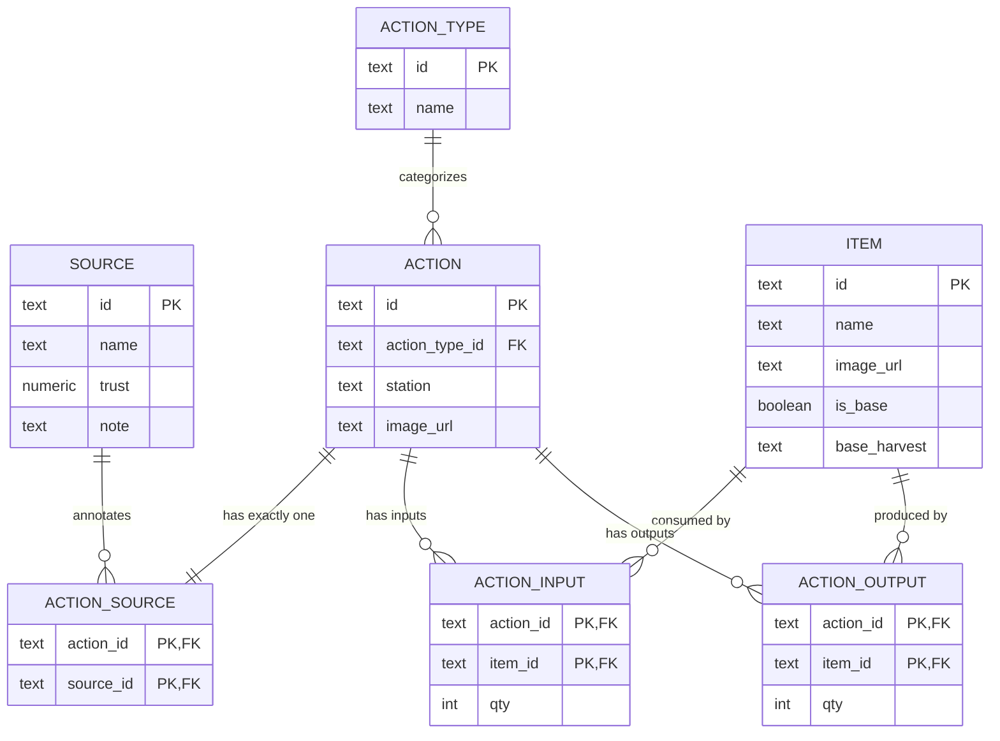

# Minecraft Knowledge DB – Documentation

This documentation describes the relational schema for your “Hidden Knowledge” proof of concept.
Goal: Support multiple data sources (Sources), actions (Crafting/Smelting, etc.) with inputs and outputs, and items (including base acquisition). Paths can be resolved backward from a target item to base items; each action is linked to exactly one source.

## Overview

- source – Data sources (e.g., “Official Recipes”, “Community Variant”)

- action_type – Types of actions (Crafting, Melting, …)

- item – Items including the is_base flag and a base_harvest description

- action – Actions/recipes (logical processes, any number of outputs possible)

- action_source – Many-to-many (effectively 1:1) relationship between action and source

- action_input – Required items (with quantities) per action

- action_output – Produced items (with quantities) per action (multiple outputs allowed)

- v_action_item – View that unifies inputs & outputs

## Entity relation diagram

## Indexes & Constraints (Recommendations)

- action_input(item_id) – quickly find all consumers of a resource

- action_output(item_id) – quickly find all producers of an item

- action_source(source_id) – source-filtered views

- action(action_type_id) – type filtering

- Optional: deferrable foreign keys if you are doing bulk loads

## Modeling Decisions

- One source per action: Differences between sources are modeled as separate actions (e.g., act_pickaxe_correct vs. act_pickaxe_bad), each linked to its own action_source. This makes conflicts explicitly comparable.

- Multiple outputs per action: Supported (e.g., byproducts). Path queries then select the action per target output.

- Base items: Base items can also be craftable. In paths, two alternatives may appear: Acquire (via base_harvest) and Crafting chain.

- Harmonization: Items and action types are source-agnostic; the source is attached to the action.